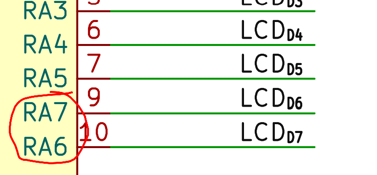

# Errata, Rev 1 PCBA
This section describes any erratas with Rev 1's PCB or PCBA

## E1 - Pin Swapping on LCD
Due to my own version of the symbol for the PIC microcontroller I made, I accidentally swapped pins RA6 and RA7 visually on the schematic, so I wired them flipped

### Fix
Either a painful hardware fix with trace cutting...or a software fix like I implemented in F1202.

## E2 - UART TX No Pullup
On power-on, or MCU restart, the UART "transmits" 0x00 due to the lack of a pull-up on that line and the rising edge when the IOs are initialized.

### Fix
Either deal with the initial 0 on the line when powering on or restarting the firmware, or add a 10k pull-up resistor from TX to VCC
